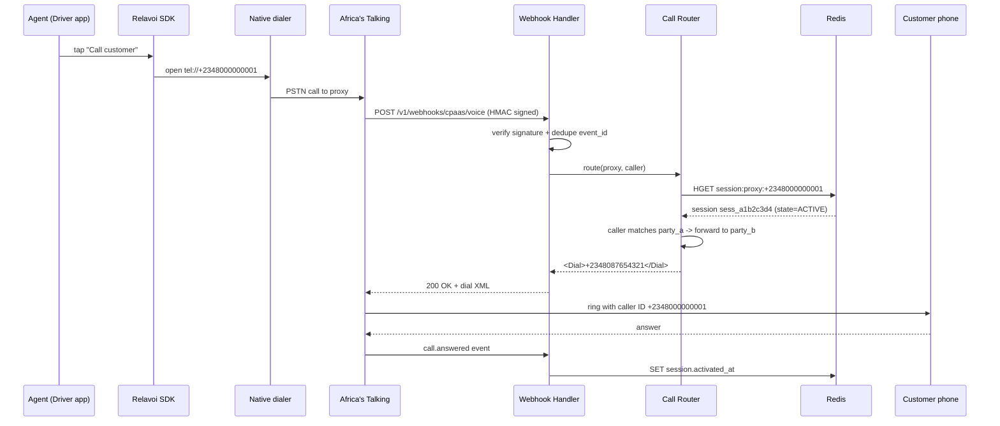
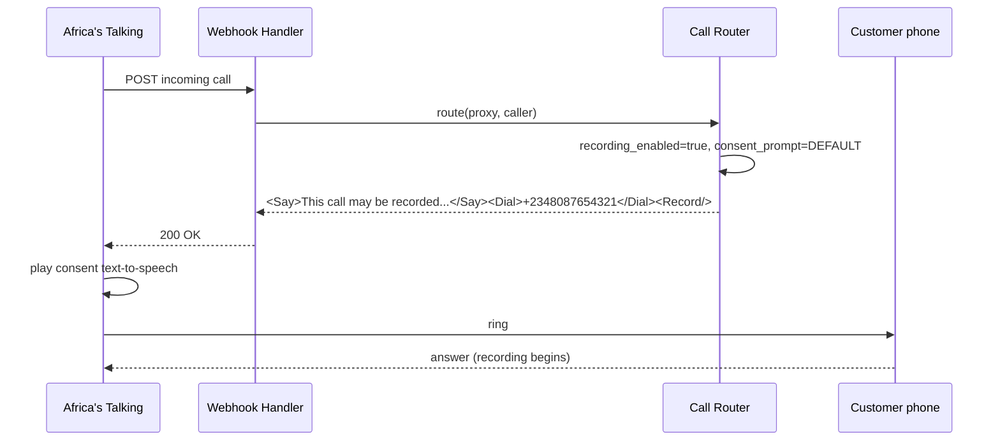

# Call flow and routing

This guide walks the full request path of a masked voice call and shows where each millisecond goes.

## Primary call flow

The agent taps "Call customer" in your app. The SDK already knows the active session and proxy number. From there:

## Recording consent flow

When `recordingEnabled = true`, the Call Router prepends a `<Say>` or `<Play>` action before the `<Dial>`. The bridge does not happen until the consent prompt finishes.

If `consentPrompt = CUSTOM`, the router emits `<Play>https://cdn.tenant.com/consent.mp3</Play>` instead.

## Latency budget

Our routing SLO is `p99 < 500 ms` from webhook receipt to dial response. The budget breakdown:

| Stage | Budget | Notes |
|-------|--------|-------|
| TLS + HTTP parse | 20 ms | Fastify with HTTP/2 |
| HMAC signature verify | 5 ms | `crypto.timingSafeEqual` |
| Redis dedup lookup | 5 ms | `GET webhook:dedup:{event_id}` |
| Redis session lookup | 10 ms | `HGETALL session:proxy:{number}` |
| Routing decision | 5 ms | Pure CPU, no I/O |
| Response serialization | 10 ms | XML build |
| Network back to CPaaS | 30 ms | Same-region (Cape Town) |
| **Total p50** | ~85 ms | |
| **Total p99 headroom** | 415 ms | Absorbs GC pauses, retries |

Anything that pushes routing onto PostgreSQL violates the budget. The Call Router is explicitly designed to never hit Postgres on the hot path.

:::tip Observe your own latency
The `routing.latency.ms` metric is surfaced per tenant in [Analytics](../api-reference/analytics). Set an alert at p99 > 400 ms to catch degradation before customers notice.
:::
