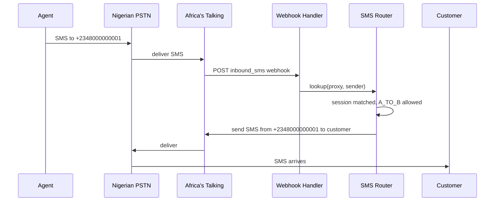

# SMS masking

Every Relavoi session is dual-channel: the same proxy number that carries voice also relays SMS between the two parties. There is no separate "SMS session" object — if you have an ACTIVE voice session, SMS just works.

## How a message moves



Replies follow the same path in reverse. Neither party ever sees the other's real MSISDN.

## Encryption at rest

Message bodies are encrypted with **AES-256-GCM** using a tenant-scoped key. The ciphertext, nonce, and auth tag are stored in `sms_records.message_text_enc`. Plaintext is only materialized in memory in the SMS Router for the few milliseconds between decryption and forwarding — and it is **never returned by any API**. The SMS history endpoint exposes metadata only (see below).

The same encryption envelope is used for phone numbers themselves — see [Security](./security) for the full crypto model.

## Direction mode enforcement

Direction modes you set at session create time apply to SMS exactly as they do to voice:

| directionMode | Agent -> Customer SMS | Customer -> Agent SMS |
|---------------|----------------------|----------------------|
| BIDIRECTIONAL | delivered | delivered |
| A_TO_B_ONLY | delivered | dropped |
| B_TO_A_ONLY | dropped | delivered |

A message that violates the session's direction mode is dropped and **not** persisted — there is no `sms_records` row and no delivery attempt.

## Reading message history

```bash
curl https://api.relavoi.com/v1/sessions/{sessionId}/sms \
  -H "Authorization: Bearer $RELAVOI_JWT"
```

The response is paginated (`{ "data": [...], "pagination": { "count", "after" } }`). Each record carries `id`, `sessionId`, `direction`, `status` (`PENDING`, `DELIVERED`, or `FAILED`), `cpaasMessageId`, `cpaasProvider`, `sentAt`, and `deliveredAt`. The message body is **never** included.

See [SMS API reference](../api-reference/sms) for the full schema and filters.

:::note Outbound from your backend
Sending SMS from your backend directly to a customer (i.e. without an inbound trigger) is on the roadmap — see the SMS reference for status. For now, SMS is bidirectional within an active session only.
:::
